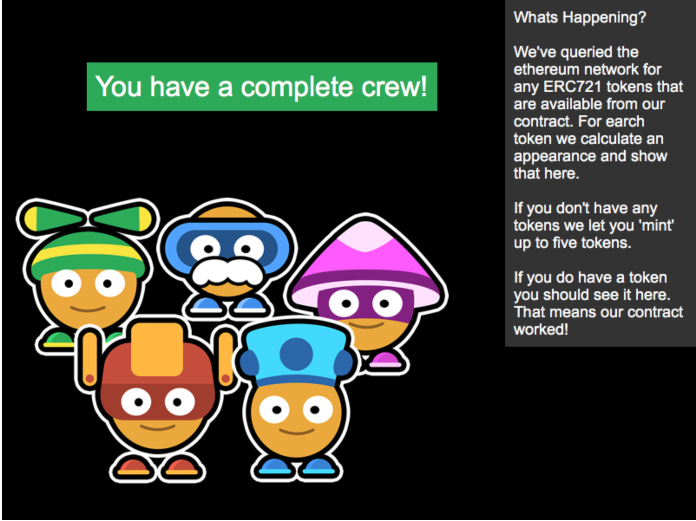

# Demo DApp

Check out our running example [here](https://example-dapp-1.bitski.com/)



## Create your credentials

You'll need an app id to actually run this demo. Visit https://developer.bitski.com/ and click "Create App". You can enter anything for the name and leave the url blank for now.

Once your app is created, view your app details, then go to the OAuth settings, and under Redirect Urls, add the following:

http://localhost:3000/callback.html

At this point, your Bitski app should be ready to go. Create a `.env` file in the root of this project, then copy the app id from the app details page, and paste it like this:

```
BITSKI_CLIENT_ID=YOUR-APP-ID
```

## Running Locally

Now you should be ready to run the demo app locally. First, install the dependencies.

```bash
npm install
```

Next, you'll need to use Truffle to deploy the contract. We'll start by running the contract on a local blockchain. Start by installing truffle globally.

```bash
npm install -g truffle
```

Then, start truffle's development blockchain

```bash
truffle develop
```

Once the development blockchain is running, then run the migrations in the dev console:

```bash
truffle(develop)> migrate
```

You can learn more about deploying contracts with truffle [here](http://truffleframework.com/docs/getting_started/migrations).

Once the contracts are deployed, you can start the development server. Make sure to run the dev server in another terminal.

```bash
npm run dev
```

Then browse to [http://localhost:3000](http://localhost:3000) to interact with the app.

## Deploying to a real network

Once you have your dapp how you want it, you'll want to deploy it to a live blockchain somewhere. This can be achieved using a local Ethereum node, or with Bitski's app wallet feature.

To use Bitski to deploy your contract, you'll need to create an App Wallet. Visit the [developer portal](https://developer.bitski.com), find your app in the list, and click it to view the details.

Under the Wallets tab, click _New Wallet_. Then, visit the _Backend Credentials_ tab and click _New Credential_. You'll want to copy and paste both the credential id, and secret into your `.env` file like this:

```
BITSKI_CLIENT_ID=YOUR-CLIENT-ID
BITSKI_CREDENTIAL_ID=YOUR-CREDENTIAL-ID
BITSKI_CREDENTIAL_SECRET=YOUR-CREDENTIAL-SECRET
```

At this point, you should be ready to deploy your contracts.

_Note: Make sure you have some ETH in your new app wallet before you try to migrate. The exact amount of ETH you will need depends on the contract._

To migrate your contract, decide which network you want to use, then run:

Mainnet:
```bash
truffle migrate
```

Kovan:
```bash
truffle migrate --network kovan
```

Rinkeby:
```bash
truffle migrate --network rinkeby
```

Once you've deployed your contract, update your `bitski.config.js` to reflect your network choice. Edit the network name under environments. This will make sure the web app will know what network to look for.

_Note: You can configure networks for both development and production separately. You have the option to use a local test network for development, or once the contract is deployed, you can also develop against a real network. `npm run dev` will use the development options, and `npm run build` will use the production options._

## Deploying the web assets

If you want to host your version of this dapp somewhere publicly, make sure to add the proper redirect url to both your `bitski.config.js` and your app on the Bitski Developer Portal. You won't be able to log in unless the redirect url passed in exactly matches what is listed in your app's settings.

To build the app for production, simply run:

```bash
npm run build
```

The app will be compiled into the `./dist` directory. You should be able to simply drop these assets on any standard web server to host.

## Token Metadata

ERC721 tokens support various metadata by providing a URL for the token that includes structured information in json. This is stored on the blockchain when each token is minted. Update the `tokenURIBaseURL` value in webpack.config.js to provide a valid url if you would like to use this functionality.

## Modifying the Smart Contract

The backend of our dapp is a contract on Ethereum. The code of this contract is located in [contracts](contracts/).

## Game

The front end of our app is a game using the Phaser framework. The code is located in [app](app/) and the assets are located in ```assets```.
